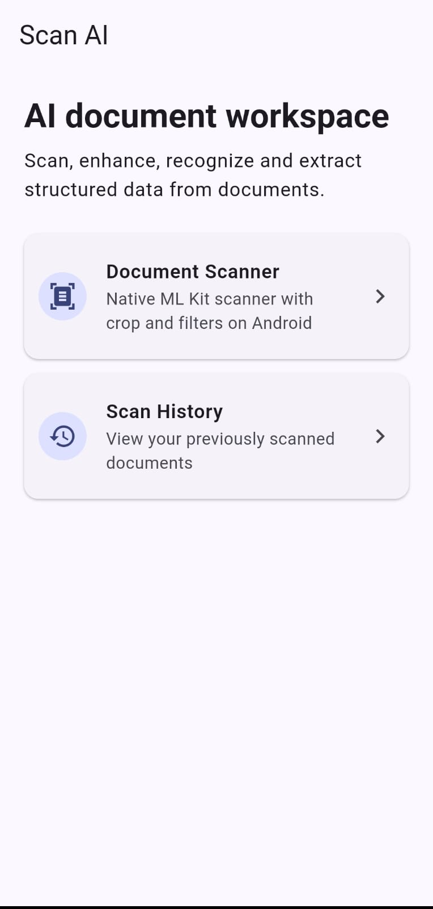
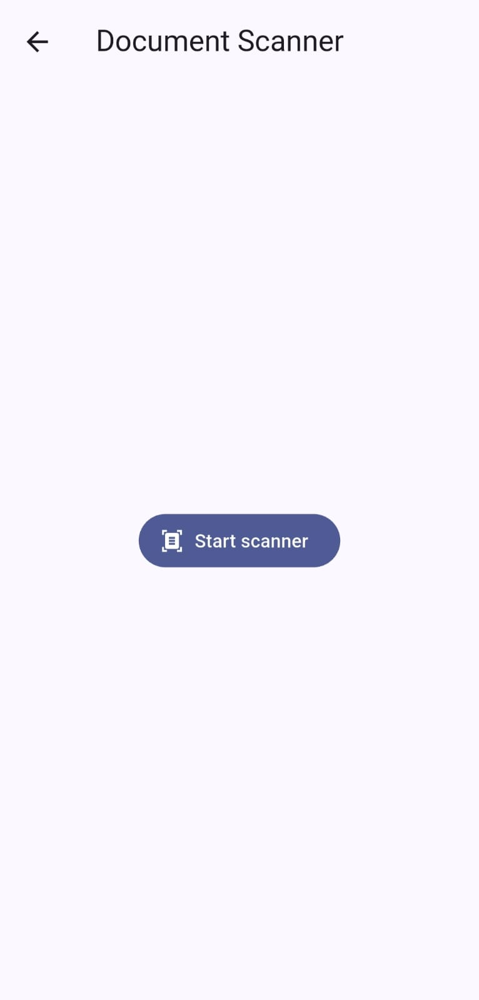
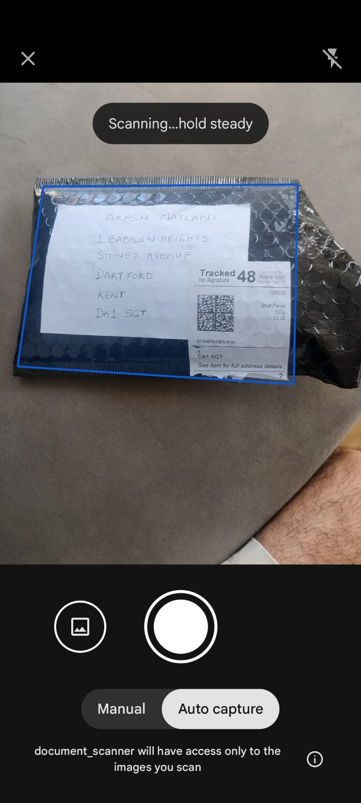
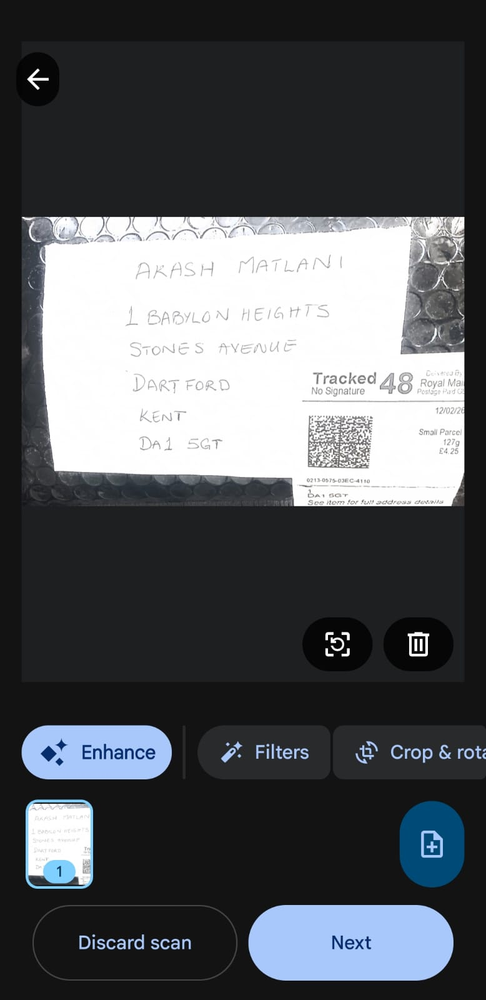
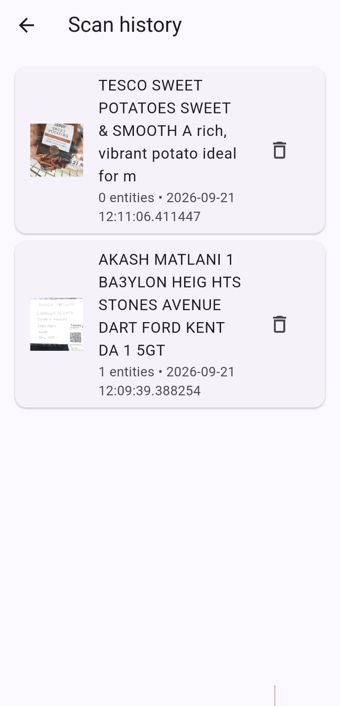

# ScanAI

A Flutter app for scanning documents, extracting text with OCR, detecting useful entities, and keeping scanned documents locally.

The main idea is simple:

**Scan → OCR → Extract → Save → Review**

Scan a document, let OCR extract the text, detect useful entities, and keep the scanned document available in the app's history.

## 📸 Screenshots

<p align="center"> 



 

</p>

## What it does

* Scan documents using Google ML Kit Document Scanner
* Extract text using Google ML Kit Text Recognition
* Pick an image from the gallery and run OCR
* Capture an image using the camera and run OCR
* Crop images before processing
* Enhance images and convert them to grayscale before OCR
* Extract entities from recognized text
* Save scanned documents locally
* Keep scanned images in the app's local storage
* View previously scanned documents in Scan History
* Delete saved documents from history
* Share recognized text
* Live camera OCR
* Business card / entity extraction mode

## Tech stack

The app is built with Flutter and uses:

* Flutter
* Dart
* Riverpod for state management
* GoRouter for navigation
* Google ML Kit Document Scanner
* Google ML Kit Text Recognition
* Image Picker
* Image Cropper
* Share Plus
* Shared Preferences
* Path Provider
* Image package
* Camera

## Project structure

The project is split into features, core services, models, and providers.

```text
lib/
├── core/
│   ├── models/
│   └── services/
│
├── features/
│   ├── home/
│   ├── history/
│   ├── live_ocr/
│   ├── ocr/
│   └── scanner/
│
├── providers/
│   └── app_providers.dart
│
└── main.dart
```

Some of the important pieces are:

### Document scanner

The main document scanning flow uses Google ML Kit Document Scanner on Android.

The processing flow is:

```text
Scan document
     ↓
Google Document Scanner
     ↓
Scanned image
     ↓
ML Kit Text Recognition
     ↓
Entity extraction
     ↓
Copy image to app storage
     ↓
Save document metadata
     ↓
OCR results page
     ↓
Scan History
```

The scanned image is copied into the app's local `scans` directory before the document is saved.

This means the saved document does not depend on the temporary image path returned by the scanner.

### OCR

OCR is handled by `OcrService`.

The service creates an ML Kit `InputImage` from the image path and processes it with the configured text recognizer.

```dart
final input = InputImage.fromFilePath(path);
final result = await _recognizer.processImage(input);

return result.text.trim();
```

The recognized text is then passed to the entity extraction service.

### State management

Riverpod keeps the current scan state available between the scanner and OCR pages.

The main scan state contains:

```text
imagePath
text
entities
busy
error
```

This allows the scanner and OCR result screens to share the current scan without manually passing the OCR result through the route.

## Running the project

Make sure Flutter is installed and your Android development environment is configured.

Then:

```bash
git clone https://github.com/AkashMatlani/document_scanner.git
cd document_scanner
flutter pub get
```

Run the app with:

```bash
flutter run
```

The Google ML Kit Document Scanner flow is currently used on Android and requires Google Play services.

## Android requirements

The project uses Google ML Kit packages, so the Android configuration is important.

The document scanner requires:

* A compatible Android device or emulator
* Google Play services
* A compatible Google Play services / ML Kit environment

The app checks Google Play services before attempting to launch the document scanner.

If Google Play services are unavailable or unsupported, the document scanner cannot be launched.

## Main packages

The important dependencies currently include:

```yaml
go_router: ^18.0.1
flutter_riverpod: ^3.4.3
image_picker: ^1.2.3
image_cropper: ^12.2.1
share_plus: ^13.3.0
google_mlkit_document_scanner: ^0.6.1
google_mlkit_text_recognition: ^0.17.1
google_mlkit_commons: ^0.13.0
path_provider: ^2.1.6
path: ^1.9.1
image: ^4.9.2
shared_preferences: ^2.5.5
camera: ^0.12.1
google_api_availability: ^5.0.1
cupertino_icons: ^1.0.8
```

## Navigation

The main routes are:

```text
/                  Home
/scanner           Document Scanner
/ocr               OCR results
/business-card     Business card / entity mode
/live-ocr          Live camera OCR
/history           Saved documents
```

After a successful document scan:

```text
/scanner
   ↓
Google Document Scanner
   ↓
OCR processing
   ↓
Entity extraction
   ↓
Local document save
   ↓
/ocr
```

The OCR page displays:

* The scanned image
* Recognized text
* Detected entities
* Sharing controls
* Image enhancement / grayscale OCR

The Home page also provides access to Scan History.

## Local storage

Scanned documents are stored locally on the device.

The app stores document metadata using `SharedPreferences` and stores the actual scanned image files in the application's documents directory.

Saved images are placed in:

```text
<application documents directory>/scans/
```

Each document contains information such as:

```text
id
imagePath
text
createdAt
entities
```

The stored document metadata is serialized as JSON.

### Image persistence

The image returned by the scanner or selected from the device is copied into the app's own storage before the document is added to history.

This prevents the saved document from depending on a temporary scanner or picker file.

If document persistence fails after the image has been copied, the copied image is removed as cleanup so an orphaned scan file is not intentionally left behind.

### Scan History

The History page loads saved documents from local storage and displays:

* A preview of the saved image
* Recognized text
* Number of detected entities
* Creation date

Deleting a document from History removes its saved metadata and associated image file.

## OCR enhancement

There is an optional:

**Enhance + grayscale + OCR**

action.

This takes the current image, processes it using the image service, converts it to grayscale when requested, and runs OCR again.

It can be useful when the original image does not produce good OCR results.

## Entity extraction

Recognized text is passed through the application's entity extraction service.

Detected entities are stored together with the document and displayed on the OCR results page.

The exact entities detected depend on the rules implemented by the application.

## Current limitations

A few things are worth keeping in mind:

* Google ML Kit Document Scanner is currently used through the Android scanner flow in this project.
* Google Play services are required for the Android document scanner.
* OCR quality depends on image quality, lighting, document layout, and text clarity.
* Entity extraction is based on the rules implemented in the application and is not intended to replace a full NLP system.
* Local history is stored on the device and is not currently synchronized with a cloud service.

## Development

During development, the basic workflow is:

```bash
flutter pub get
flutter analyze
flutter run
```

If you change native Android configuration or ML Kit dependencies, it can be useful to run:

```bash
flutter clean
flutter pub get
flutter run
```
